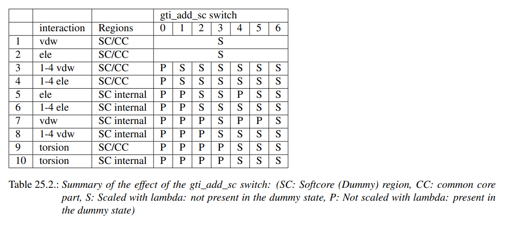

# Common-core calculations using the BAT software

Here we introduce the BAT implementation of common-core relative binding free energy (RBFE) calculations, which are more widely used in comparison to RBFE using separated topologies (SepTop), and for this reason we will also refer to them as regular RBFE. Regular RBFE calculations maintain a common substructure between the two ligands during their transformation, and do not require the application of restraints as in ABFE or RBFE with SepTop. The calculations shown here are compatible only with AMBER's *pmemd.cuda* MD engine, and are based on the AMBER tutorial for alchemical free energy calculations using soft-core potentials (https://ambermd.org/tutorials/advanced/tutorial9/index.html). 

We will apply the three-step cycle from the tutorial above, which has two electrostatic and one Lennard-Jones (LJ) free energy calculations. The main difference in our method is that these three calculations will use the simultaneous decoupling and recoupling (SDR) approach, in which the ligands undergo opposite transformations in the binding site and bulk solvent, in a single simulation box. The SDR method is advantageous because it allows for transformations between ligands with different net charges, since the electrostatic calculations will always maintain the same net charge of the simulation box, avoiding well known artifacts. 

# Required software and input files

In order to perform the calculations shown here, the user must have the same dependencies from the BAT software, with the *pmemd.cuda* software from AMBER being mandatory instead of OpenMM. The input files needed are also the same as the ABFE BAT workflow, which are the coordinates of the ligands and protein in PDB format, the reference.pdb file, and the BAT input file. All variables from the latter file are identical to the ABFE workflow, so the setup of any new protein system can be done in the same way, as well as all the other simulation-related options.

It is, although, necessary that BAT recognizes the atoms from the two ligands that are part of their common substructure, and for that reason the two input ligand PDB files must follow a few rules:

- They should already be protonated, and the atoms from a given ligand must all have unique names. 
- All heavy atoms should be listed first in the PDB file, regardless of order, then followed by all the hydrogens.
- Atoms in equivalent positions in the common substructure must have the same names in the two ligand PDB files. Their coordinates do not have to perfectly match, but they are expected to be similar since the binding mode should be preserved to apply regular RBFE.

There are open-source tools that can perform atom-mapping to recognize common substructures between ligands, and they, and likely others, will be added with time to fully automate the process. I am in fact open to suggestions on that matter.

Concerning BAT common-core RBFE input file, since the input ligands are already protonated and we wish to maintain this state, the user should choose 'yes' for the *retain\_lig\_prot* variable, and define the associated ligand net charge using the *ligand\_charge* variable. This net charge applies to all ligands in the *ligand_list* array, so ligands with different net charges should have their parameter generation and equilibration procedure (*equil* step) performed separately. They can be combined again in the same input file when performing the *fe* and *analysis* stages. The ligand parameters can also be provided by the user instead of generated by BAT, as explained in the BAT user guide, as long as the atom naming in the .mol2 files also follows the same rules above. 

We also include the *gti\_add\_sc* variable to the BAT common-core RBFE input file, which allows the user to choose which non-bonded and bonded interactions will be scaled with lambda during the transformations. The different values of this variable will scale the energy contributions according to the table below, obtained from the AMBER user guide:

More details on this variable, and on the theory and methods behind AMBER's common-core RBFE calculations, can be found in the AMBER user guide.

# Running a sample calculation

We provide example calculations for three pairs of ligands that bind to the BRD4(2) bromodomains and display high similarity, making them suitable for regular RBFE calculations.  

 

   
