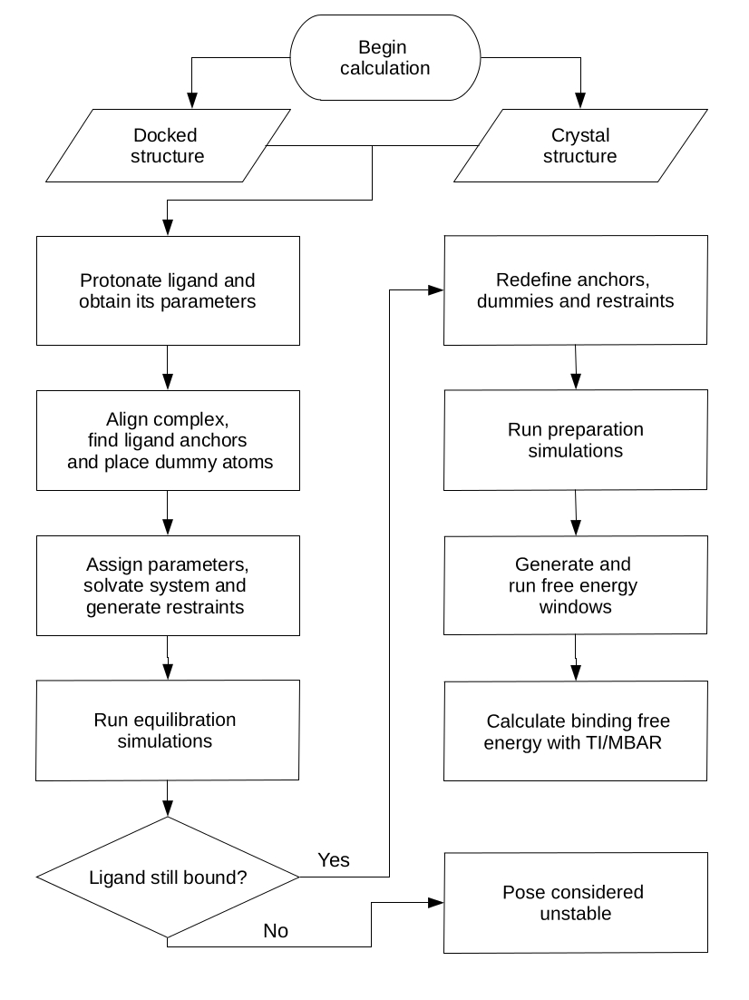

*Coming soon: GHDD.py, a fully automated tool for guest-host ABFE calculations using DD with pmemd.cuda*

# BAT.py

The Binding Affinity Tool (BAT.py) is a python tool for fully automated absolute binding free energy calculations. Its workflow encompasses the creation of the bound complex, generation of parameters using Antechamber, preparation of the simulation files, and post-processing to retrieve the binding free energy. By using the _pmemd.cuda_ software from AMBER, it is able to perform several calculations at a reduced computational cost using graphics processing units (GPUs).

BAT.py can perform binding free energy calculations by an alchemical route, using a double decoupling (DD) procedure in the presence of restraints, or using a physical route through the APR method. The program is compatible with AMBER18, also requiring a few installed programs to work properly, which are listed in the next section. 

# Getting started

To use BAT.py, download the files from this repository, which already contain an example for ligand binding to the second bromodomain of the BRD4 protein - BRD4(2). In order to perform all the steps from BAT.py, the following programs must be installed and in your path:

VMD (Visual Molecular Dynamics) [1] - https://www.ks.uiuc.edu/Development/Download/download.cgi?PackageName=VMD

Openbabel [2] - http://openbabel.org/wiki/Category:Installation

MUSTANG v3.2.3 (MUltiple (protein) STructural AligNment alGorithm) [3] - http://lcb.infotech.monash.edu.au/mustang/

AmberTools18 or later [4] - http://ambermd.org/AmberTools.php

_pmemd.cuda_ software from AMBER18 [4] - http://ambermd.org/GetAmber.php 

The folder ./BAT/all-poses contains an example of system input files, with a docked receptor from the 5uez crystal structure (LMCSS-5uf0_5uez_docked.pdb), as well as 9 docked poses for the ligand with the 5uf0 crystal structure (pose0.pdb to pose8.pdb). The docking files were generated and converted to .pdb using Autodock Vina and AutodockTools, following a protocol adapted from the CELPP challenge tutorial (https://docs.google.com/document/d/1iJcPUktbdrRftAA8cuVa32Ri1TPr2XvZVqTccDja2OM). Inside the ./all-poses folder there is also the original crystal structure file for 5uf0. Below we show an example of using these files to calculate the standard binding free energies of the top 5 docked poses and the crystal structure, with all the necessary steps in the calculation. 

# Running a sample calculation

The simulations and analysis from this example will be performed inside the ./BAT folder. They are divided in three steps, equilibration (folder ./equil), preparation (folder ./prep) and free energy calculation (folder ./fe). The input file with all the needed BAT.py parameters is called input.in, with the meaning of each explained in more detail in the user guide, located inside the ./doc folder. For our sample calculation, we will use the values already provided in the input.in file included in this distribution. Briefly, the poses_list parameter sets up the calculation for the first 5 poses from Autodock Vina, all in the ./all-poses folder. The input.in file can be modified to perform the calculations in the 5uf0 crystal structure, by changing the calc_type option to "crystal", the celpp_receptor option to "5uf0", and the ligand_name option to "89J", which is the ligand residue name in the 5uf0 pdb structure. 

## Equilibration

The equilibration step starts from the docked complex or the crystal structure, gradually releasing restraints applied on the ligand and then performing a final simulation with an unrestrained ligand. The necessary simulation parameters for the ligand are also generated in this stage, using the General Amber Force Field versions 1 and 2 (GAFF or GAFF2) [5], and the AM1-BCC charge model [6,7]. To run this step, inside the program main folder type:

python BAT.py -i input.in -s equil

BAT.py is compatible with python 2.7 versions. If you have another version, or you find that this command gives an error, you can use the python version included in the Ambertools distribution:

$AMBERHOME/miniconda/bin/python BAT.py -i input.in -s equil

This command will create an ./equil folder, with one folder inside for each of the docked poses (pose0, pose1, etc.). In order to run the simulations for each pose, you can use the run-local.bash script (to run them locally), or the PBS-run script, which is designed to run in a queue system such as TORQUE. Both of these files might have to be adjusted, depending on your computer or server configuration. The number of simulations and the applied restraints will depend on the _release_eq_ array defined in the input file. 

## Preparation

The second stage starts from the equilibrated system, rebuilding the latter, as well as redefining the dummy/anchor atoms and the restraints for use in the free energy calculation. To run this stage, type in the program main folder:

python BAT.py -i input.in -s prep

, or use the miniconda option as shown in the previous section. It is possible that the ligand has left the binding site during equilibration, due to an unstable docked pose. In this case, the preparation is not performed for this pose, and a warning message appears after running the command above. The same way as the equil stage, there is a folder for each pose (given that it did not unbind during equilibration) in the ./prep directory, and the simulations can be run locally or in a queue system such as TORQUE. Once the preparation simulations are concluded, the systems are ready for the binding free energy calculations. 

## Free energy calculation 

### Simulations

Starting from the states created in the prep stage, we can now perform the binding free energy calculations, which will be located inside the ./fe folder. In this example we will use the double decoupling method with retraints to obtain the binding free energies, which is more suitable for this type of calculation. Again in the program main folder, type:

python BAT.py -i input.in -s fe

For each pose or crystal structure, a folder will be created inside ./fe, and inside there will be two folders, ./restraints and ./dd. The restraints folder contains all the simulations needed for the application/removal of restraints. The ./dd folder contains the coupling/decoupling of the ligand electrostatic/LJ interactions, both in the binding site and in bulk. A script called run-all.bash, inside the ./run_files folder, can be used to run these simulatons quickly using the PBS scripts provided. A similar script can be written to do the same, using your particular running protocol. 

### Analysis

Once all of the simulations are concluded, it is time to process the output files and obtain the binding free energies. Here a few parameters concerning the analysis can be set in the input.in file, such as using TI or MBAR [8] for double decoupling, number of blocks for block data analysis, and the Gaussian weights if TI is used for double decoupling. Inside the main folder type:

python BAT.py -i input.in -s analysis

You should see a ./Results directory inside each ./fe/pose folder, containing all the components and the final calculated binding free energy, located in the Results.dat file. This folder also contains the results for each of the chosen data blocks, which is useful to check for convergence and fluctuations, and is also used to calculate the uncertainties. This fully automated procedure can be readily applied for any other ligand that binds to the second BRD4 bromodomain, and with minimal adjustments it can be extended to several other proteins.

## Using the APR method

Even though the APR method presents limitations, it could stil be useful for ligands that bind to the surface of proteins and have clear access to the solvent. To apply APR in addition to DD, a few parameters have to be changed or added to the BAT.py input file. This procedure is described in the user guide and also on Ref. [9].  

# Extending it to other systems

## Additional ligands to BRD4(2)

The sample system shown here uses a particular ligand that binds to the second bromodomain of the BRD4 protein - BRD4(2). The system alignment, parameter generation, assignment of the ligand anchor atoms, and positioning of the dummy atoms is done automatically, so these same calculations can be extended to any other ligand that binds to this receptor. The only thing needed is the files in the ./all-poses folder to be changed, including the docked receptor and poses pdb files, as well as the crystal structure if desired.     

## Additional receptors

To include a new receptor system, some additional input data is needed. They include a reference.pdb file to align the system using MUSTANG, three chosen protein anchors, and a few variables for ligand anchor atom search. These can be found inside the ./systems-library folder for three other bromodomains (CREBBP, BRD4(1) and BAZ2B), T4 Lysozyme, the Major Urinary Protein (MUP), and the Retinol binding protein 1 (RetBP). Other systems will be added with time, as the program is further tested and validated.    

# More information

A paper explaining the whole BAT.py theoretical aspects and calculation procedure is currently under review [9], and can be found on the link https://www.biorxiv.org/content/10.1101/2020.04.15.043240v1. For more information you can contact the author directly:

Germano Heinzelmann  
Departamento de Física, Universidade Federal de Santa Catarina  
Florianópolis - SC  88040-970 Brasil  
email: germanohei@gmail.com  

# Acknowledgments

Germano Heinzelmann thanks FAPESC and CNPq for the research grants.

# References

1. W. Humphrey, A. Dalke and K. Schulten. (1996)  "VMD - Visual Molecular Dynamics", Journal of Molecular Graphics, 14, 33-38.

2. N. M. O'Boyle, M. Banck, C. A. James, C. Morley, T. Vandermeersch, and G. R. HutchisonEmail. (2011) "Open Babel: An open chemical toolbox." Journal of Cheminformatics, 3, 33.

3. A. S. Konagurthu, J. Whisstock, P. J. Stuckey, and A. M. Lesk. (2006) “MUSTANG: A multiple structural alignment algorithm”. Proteins, 64, 559-574.

4. D.A. Case, I.Y. Ben-Shalom, S.R. Brozell, D.S. Cerutti, T.E. Cheatham, III, V.W.D. Cruzeiro, T.A. Darden, R.E. Duke, D. Ghoreishi, M.K. Gilson, H. Gohlke, A.W. Goetz, D. Greene, R Harris, N. Homeyer, S. Izadi, A. Kovalenko, T. Kurtzman, T.S. Lee, S. LeGrand, P. Li, C. Lin, J. Liu, T. Luchko, R. Luo, D.J. Mermelstein, K.M. Merz, Y. Miao, G. Monard, C. Nguyen, H. Nguyen, I. Omelyan, A. Onufriev, F. Pan, R. Qi, D.R. Roe, A. Roitberg, C. Sagui, S. Schott-Verdugo, J. Shen, C.L. Simmerling, J. Smith, R. Salomon-Ferrer, J. Swails, R.C. Walker, J. Wang, H. Wei, R.M. Wolf, X. Wu, L. Xiao, D.M. York and P.A. Kollman (2018), AMBER 2018, University of California, San Francisco.

5. J. Wang, R.M. Wolf, J.W. Caldwell, and P. A. Kollman, D. A. Case (2004) "Development and testing of a general AMBER force field". Journal of Computational Chemistry, 25, 1157-1174.

6. A. Jakalian, B. L. Bush, D. B. Jack, and C.I. Bayly (2000) "Fast, efficient generation of high‐quality atomic charges. AM1‐BCC model: I. Method". Journal of Computational Chemistry, 21, 132-146.

7. A. Jakalian, D. B. Jack, and C.I. Bayly (2002) "Fast, efficient generation of high‐quality atomic charges. AM1‐BCC model: II. Parameterization and validation". Journal of Computational Chemistry, 16, 1623-1641.

8. M. R. Shirts and J. Chodera (2008) “Statistically optimal analysis of samples from multiple equilibrium states.” Journal of  Chemical Physics, 129, 129105.

9. G. Heinzelmann and M. K. Gilson (2020). “Automated docking refinement and virtual compound screening with absolute binding free energy calculations”.

