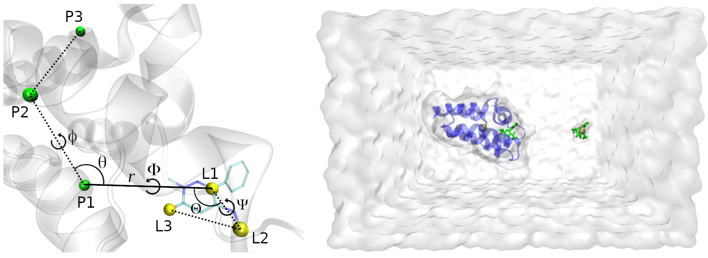
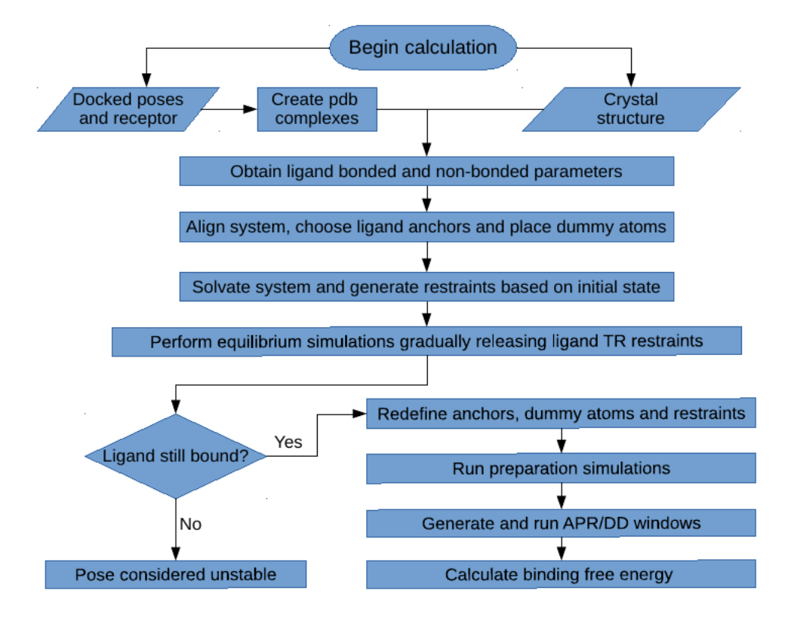

\- - - - - - - - - - - - - - - - - - - - - - - - - - - - - - - - - - - - - - - - - - - - - - - - - - - - 

*JUST RELEASED: The BAT.py 2.2 version, with the following new features:*

*- Support for proteins with multiple chains*

*- Inclusion of cobinders such as ions*

*- Additional water models*

*- Use of the lovoalign protein alignment software, replacing MUSTANG*

*The 2.2 version is still being thoroughly tested, so the user can download the latest stable release instead (BAT 2.1).* 

\- - - - - - - - - - - - - - - - - - - - - - - - - - - - - - - - - - - - - - - - - - - - - - - - - - - -

*See also: GHOAT.py, a fully automated tool for guest-host ABFE calculations using SDR with pmemd.cuda:* 

https://github.com/GHeinzelmann/GHOAT.py 

*A tutorial and a detailed user guide are available, as well as necessary parameter and input files for several hosts.*

# BAT.py v2.1

The Binding Affinity Tool (BAT.py) is a python tool for fully automated absolute binding free energy (ABFE) calculations using all-atom Molecular Dynamics (MD). Its workflow encompasses the creation of the bound complex, generation of parameters using Antechamber, preparation of the simulation files, and post-processing to retrieve the binding free energy. BAT can set up simulations for the _pmemd.cuda_ software from AMBER20, or the OpenMM program combined with OpenMMtools, both capable of performing simulations at a reduced computational cost using graphics processing units (GPUs).

The 2.1 version of BAT.py can perform ABFE calculations by two alchemical routes in the presence of restraints, either with the double decoupling (DD) procedure or with the simultaneous decoupling and recoupling (SDR) method, the latter suitable for ligands with net charge. For binding free energy calculations using the attach-pull-release (APR) method, download the 1.0 version of the code at the BATv1.0 branch, or the BAT 1.0 release. In addition to AMBER20 _pmemd.cuda_ or OpenMM 7.7.0, BAT.py also requires a few additional programs to work properly, which are listed in the next section. 

# Getting started

To use BAT.py, download the files from this repository, which already contain an example for ligand binding to the second bromodomain of the BRD4 protein - BRD4(2). In order to perform all the steps from BAT.py, the following programs must be installed and in your path:

VMD (Visual Molecular Dynamics) [2] - https://www.ks.uiuc.edu/Development/Download/download.cgi?PackageName=VMD

Openbabel 2.4.1 [3] - https://github.com/openbabel/openbabel/releases/tag/openbabel-2-4-1 a

Lovoalign: Protein Structural Alignment  [4] - https://www.ime.unicamp.br/~martinez/lovoalign/home.html

AmberTools20 or later [5] - http://ambermd.org/AmberTools.php b

_pmemd.cuda_ software from AMBER20 [5] - http://ambermd.org/GetAmber.php c

a Had protonation issues when using Openbabel 3, so keeping the 2.4.1 version for now, might change in the future. 

b If pdb4amber from Ambertools does not work, add the line below to the end of your amber.sh file: 

export PYTHONPATH=$PYTHONPATH:$AMBERHOME/lib/python3.8/site-packages/pdb4amber-1.7.dev0-py3.8.egg/

 c Not needed if using OpenMM for the simulations

The folder ./BAT/all-poses contains examples of input coordinate files, with a docked receptor from the 5uez crystal structure (LMCSS-5uf0\_5uez\_docked.pdb), as well as 9 docked poses for the ligand with the 5uf0 crystal structure (pose0.pdb to pose8.pdb). The docking files were generated and converted to .pdb using Autodock Vina and AutodockTools, following a protocol adapted from the CELPP challenge tutorial (https://docs.google.com/document/d/1iJcPUktbdrRftAA8cuVa32Ri1TPr2XvZVqTccDja2OM). Inside the ./all-poses folder there is also the original crystal structure file for 5uf0, in pdb format. Below we show an example of using these files to calculate the standard binding free energies of the top 5 docked poses and the crystal structure, with all the necessary steps in the calculation. 

# Running a sample calculation with AMBER20

The simulations and analysis from this tutorial will be performed inside the ./BAT folder. The simulations are divided in two steps, equilibration and free energy calculation. We will use the BAT.py input file called input-dd.in, which has the needed parameters to perform full double decoupling calculations with restraints to five docked poses. A similar input file called input-dd-long.in, with more free energy windows and longer simulation times, is also included as an example. 

Briefly, the *poses\_list* parameter in the BAT input file sets up the calculation for the first 5 poses from Autodock Vina, and the *celpp_receptor* parameter defines the name of the receptor. The file can be modified to perform the calculations in the 5uf0 crystal structure instead, by changing the *calc\_type* option to "crystal", the *celpp\_receptor* option to "5uf0", and the *ligand\_name* option to "89J", which is the ligand residue name in the 5uf0 pdb structure. More details on the various BAT parameters can be found in the user guide, located inside the ./doc folder.

## Equilibration

The equilibration step starts from the docked complex or the crystal structure, gradually releasing restraints applied on the ligand and then performing a final simulation with an unrestrained ligand. The necessary simulation parameters for the ligand are also generated in this stage, using the General Amber Force Field versions 1 and 2 (GAFF or GAFF2) [6], and the AM1-BCC charge model [7,8]. To run this step, inside the program main folder type:

python BAT.py -i input-dd.in -s equil

BAT.py is compatible with python 3.8 versions. If you have another version, or you find that this command gives an error, you can use the python version included in the Ambertools20 distribution:

$AMBERHOME/miniconda/bin/python BAT.py -i input-dd.in -s equil

This command will create an ./equil folder, with one folder inside for each of the docked poses (pose0, pose1, etc.). In order to run the simulations for each pose, you can use the run-local.bash script (to run them locally), or the PBS-run script, which is designed to run in a queue system such as TORQUE. Both of these files might have to be adjusted, depending on your computer or server configuration, which can be done in the templates located in the ./BAT/run\_files folder. The number of simulations and the applied restraints will depend on the *release\_eq* array defined in the input file. 

## Free energy calculation 

### Simulations

Once the equilibration simulations for all poses are finished, the user will now perform the free energy stage. Here, starting from the final state of the equilibrated system, BAT will reset the ligand anchor atoms and the restraints reference values for use in the free energy calculation. In this example we will use the DD method with restraints to obtain the binding free energies. For charged ligands, one should use the SDR method instead, in order to avoid artifacts arising from the periodicity of the system [1]. Again in the program main folder, type:

python BAT.py -i input-dd.in -s fe

For each pose or crystal structure, a folder will be created inside ./fe, and inside there will be two folders, ./rest and ./dd. The restraints (rest) folder contains all the simulations needed for the application/removal of restraints. The ./dd folder contains the coupling/decoupling of the ligand electrostatic/LJ interactions, both in the binding site and in bulk. A script called run-all-dd.bash, inside the ./run_files folder, can be used to run these simulatons quickly using the PBS scripts provided. A similar script can be written to do the same, using your particular running protocol. 

### Analysis

Once all of the simulations are concluded, it is time to process the output files and obtain the binding free energies. Here a few parameters concerning the analysis can be set in the input file, such as using TI or MBAR [9] for double decoupling, number of blocks for block data analysis, and the Gaussian weights if TI is used for double decoupling. Inside the main folder type:

python BAT.py -i input-dd.in -s analysis

You should see a ./Results directory inside each ./fe/pose folder, containing all the components and the final calculated binding free energy, located in the Results.dat file. This folder also contains the results for each of the chosen data blocks, which is convenient to check for convergence and fluctuations, and is also used to calculate the uncertainties. This fully automated procedure can be readily applied for any other ligand that binds to the second BRD4 bromodomain, and with minimal adjustments it can be extended to several other proteins.

### Computational cost

The full ABFE calculation above for a single pose requires a total of 248.4 nanoseconds of simulations, which can be achieved in nearly one day using a single GTX 1070 NVIDIA GPU. This time is significantly reduced when using more modern GPUs, such as the NVIDIA RTX 20 and RTX 30 series. 

The free energy simulations from BAT are separated into several independent windows, and the poses affinities are also calculated independently, which allows for trivial parallelization across multiple GPUs. This can reduce the time needed to fully evaluate a ligand to as little as one hour using several GTX 1070 GPUs, and much less that that if using more modern GPUs.

### Using the SDR method and merged restraints

The SDR method is suitable for ligands with net charge, since it keeps the two MD topologies with the same charge during the transformations. To apply SDR, a few parameters have to be changed or added, which is shown in the input-sdr.in file included in this example. This input file also uses the merged components for the restraints, which are explained in detail in the User Guide.

To apply the merged SDR method, all that is needed is to perform the free energy and analysis steps again using the input-sdr.in file. The full DD and merged SDR methods should produce consistent results if the reference state is the same from the equilibrium stage. The computational cost is also similar between the two, with a total of 284 ns of simulations for the latter method.

The user can also mix and match the separated/merged restraint components and the DD/SDR methods, for example using double decoupling with the merged restraints or the SDR method with the separated restraint components. Another possibility is to merge only the releasing or the attaching restraints, while keeping the others separate. 

# Using BAT with the OpenMM software 

BAT also allows the user to run all simulations using the free OpenMM engine. In this case, instead of the _pmemd.cuda_ software from AMBER20, the OpenMM and OpenMMTools versions below should be installed and in your path:

OpenMM 7.7.0 [10-14]: http://docs.openmm.org/latest/userguide/application/01_getting_started.html

OpenMMTools 0.21.3 [15]: https://anaconda.org/conda-forge/openmmtools

Both distributions use the Conda package manager for installation, which can be obtained at https://docs.conda.io/en/latest/ and installed following the instructions in the website. 

## Performing the calculations with OpenMM

The OpenMM simulations are fully integrated into the BAT workflow, with the equilibration, free energy and analysis steps performed the same way as explained in the tutorial above. Two input files are provided as examples, input-dd-openmm.in for double decoupling with separated restraints, and input-sdr-openmm.in for the SDR method with merged restraints. More details on the OpenMM-specific BAT input variables can be found in the User Guide.  

In order to run the equilibration and free energy simulations in the respective folders, inside them are included a bash script, to perform the simulations in a local machine, as well as a PBS script, to run in a queue system such as TORQUE. Both of these files might have to be adjusted, depending on your computer or server configuration. After concluding the simulations and performing the final analysis step, the results will be written in the same location and in the same format as with the AMBER20 version.

The user might want to compare the AMBER20 and OpenMM free energy results calculated over the same equilibrated poses states. In that case, the equilibration step should be performed using AMBER20, and the free energy step can be performed using both AMBER20 and OpenMM. Performing equilibration with the latter and free energy with the former may cause problems due to incompatibility between input/output files.    

# Extending it to other systems

## Additional ligands to BRD4(2)

The sample system shown here uses a particular ligand that binds to the second bromodomain of the BRD4 protein - BRD4(2). The system alignment, parameter generation and assignment of the ligand anchor atoms is done automatically, so these same calculations can be extended to any other ligand that binds to this receptor. The only thing needed is the files in the ./all-poses folder to be changed, including the docked receptor and poses pdb files, as well as the crystal structure if desired. 

## Additional receptors

To include a new receptor system, some additional input data is needed. They include a reference.pdb file to align the system using lovoalign, three chosen protein anchors, and possibly a few variables for ligand anchor atom search. These can be found inside the ./systems-library folder for three other bromodomains (CREBBP, BRD4(1) and BAZ2B) and the T4 Lysozyme. Other systems will be added with time, as the program is further tested and validated.

# More information and BAT.py citations

A paper explaining the whole BAT.py theoretical aspects and calculation procedure is available in Ref [1]. The OpenMM calculations are based on David Huggins work on ABFE calculations, available at Ref [16]. Please cite these two references if using the BAT code. For more information you can contact the author directly:

Germano Heinzelmann  
Departamento de Física, Universidade Federal de Santa Catarina  
Florianópolis - SC  88040-970 Brasil  
email: germanohei@gmail.com  

# Acknowledgments

Germano Heinzelmann thanks FAPESC and CNPq for the research grants, also Michael Gilson and David Huggins for the support on developing the code.

# References

1. G. Heinzelmann and M. K. Gilson (2021). “Automation of absolute protein-ligand binding free energy calculations for docking refinement and compound evaluation”. Scientific Reports, 11, 1116.

2. W. Humphrey, A. Dalke and K. Schulten. (1996)  "VMD - Visual Molecular Dynamics", Journal of Molecular Graphics, 14, 33-38.

3. N. M. O'Boyle, M. Banck, C. A. James, C. Morley, T. Vandermeersch, and G. R. HutchisonEmail. (2011) "Open Babel: An open chemical toolbox." Journal of Cheminformatics, 3, 33.

4. L. Martínez, R. Andreani, and J. M. Martínez (2007) “Convergent algorithms for protein structural alignment.” BMC Bioinformatics 8, 306.

5. D.A. Case, K. Belfon, I.Y. Ben-Shalom, S.R. Brozell, D.S. Cerutti, T.E. Cheatham, III, V.W.D. Cruzeiro, T.A. Darden, R.E. Duke, G. Giambasu, M.K. Gilson, H. Gohlke, A.W. Goetz, R. Harris, S. Izadi, S.A. Izmailov, K. Kasavajhala, A. Kovalenko, R. Krasny, T. Kurtzman, T.S. Lee, S. LeGrand, P. Li, C. Lin, J. Liu, T. Luchko, R. Luo, V. Man, K.M. Merz, Y. Miao, O. Mikhailovskii, G. Monard, H. Nguyen, A. Onufriev, F.Pan, S. Pantano, R. Qi, D.R. Roe, A. Roitberg, C. Sagui, S. Schott-Verdugo, J. Shen, C. Simmerling, N.R.Skrynnikov, J. Smith, J. Swails, R.C. Walker, J. Wang, L. Wilson, R.M. Wolf, X. Wu, Y. Xiong, Y. Xue, D.M. York and P.A. Kollman (2020), AMBER 2020, University of California, San Francisco.

6. J. Wang, R.M. Wolf, J.W. Caldwell, and P. A. Kollman, D. A. Case (2004) "Development and testing of a general AMBER force field". Journal of Computational Chemistry, 25, 1157-1174.

7. A. Jakalian, B. L. Bush, D. B. Jack, and C.I. Bayly (2000) "Fast, efficient generation of high‐quality atomic charges. AM1‐BCC model: I. Method". Journal of Computational Chemistry, 21, 132-146.

8. A. Jakalian, D. B. Jack, and C.I. Bayly (2002) "Fast, efficient generation of high‐quality atomic charges. AM1‐BCC model: II. Parameterization and validation". Journal of Computational Chemistry, 16, 1623-1641.

9. M. R. Shirts and J. Chodera (2008) “Statistically optimal analysis of samples from multiple equilibrium states.” Journal of  Chemical Physics, 129, 129105.

10. M. S. Friedrichs, P. Eastman , V. Vaidyanathan, M. Houston, S. LeGrand, A. L. Beberg, D. L. Ensign, C. M. Bruns, and V. S. Pande (2009). "Accelerating molecular dynamic simulations on graphics processing unit." Journal of Computational Chemistry, 30, 864.

11. P. Eastman and V. S. Pande (2010). "OpenMM: A hardware-independent framework for molecular simulations." Computing in science and engineering, 12, 34.

12. P. Eastman and V. S. Pande (2010). "Efficient nonbonded interactions for molecular dynamics on a graphics processing unit." Journal of Computational Chemistry, 31, 1268.

13. P. Eastman and V. S. Pande (2010). "Constant constraint matrix approximation: A robust, parallelizable constraint method for molecular simulations." Journal of Chemical Theory and Computation, 6, 434.

14. P. Eastman, J. Swails, J. D. Chodera, R. T. McGibbon, Y. Zhao, K. A. Beauchamp, L.-P. Wang, A. C. Simmonett, M. P. Harrigan, C. D. Stern, R. P. Wiewiora, B. R. Brooks, and V. S. Pande (2017). “OpenMM 7: Rapid development of high performance algorithms for molecular dynamics.” PLOS Computational Biology, 13, e1005659. 

15. J. D. Chodera and M. R. Shirts (2011). "Replica exchange and expanded ensemble simulations as Gibbs multistate: Simple improvements for enhanced mixing." Journal of Chemical Physics, 135, 194110.

16. D. J. Huggins (2022) "Comparing the Performance of Different AMBER Protein Forcefields, Partial Charge Assignments, and Water Models for Absolute Binding Free Energy Calculations." Journal of Chemical Theory and Computation, 18, 2616. 

