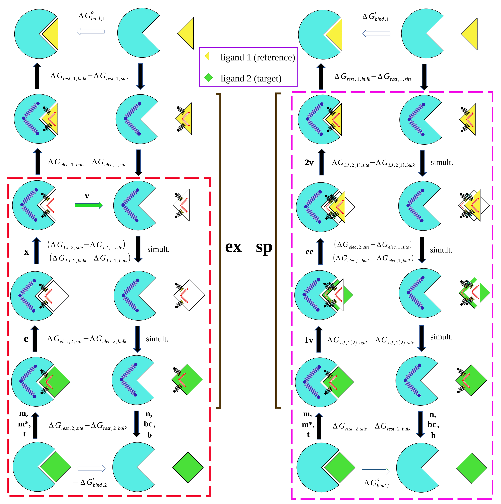

\- - - - - - - - - - - - - - - - - - - - - - - - - - - - - - - - - - - - - - - - - - - - - - - - - - - - - - - - - - - - - - - - - - - - - - - - - - - 

*Just released: The BAT.py 2.4 version, with the following new features:*

- Relative binding free energy (RBFE) calculations fully implemented into the BAT workflow, using both the regular (common-core) and the SepTop methods.

- Choice of three different thermodynamic paths for the RBFE calculations using SepTop, with the new free energy components **x**, **ex** and **sp**.

- Use of the USalign alignment program instead of lovoalign, with no installation needed

- New and easier instructions to install all the needed dependencies
 
- Example input files for ranking different ligands using both ABFE and RBFE.

\- - - - - - - - - - - - - - - - - - - - - - - - - - - - - - - - - - - - - - - - - - - - - - - - - - - - - - - - - - - - - - - - - - - - - - - - - - -

*See also: GHOAT.py, a fully automated tool for guest-host ABFE calculations using SDR, compatible with AMBER and OpenMM:* 

https://github.com/GHeinzelmann/GHOAT.py 

*A tutorial and a detailed user guide are available, as well as necessary parameter and input files for several hosts.*

# BAT.py v2.4

The Binding Affinity Tool (BAT.py) is a python tool for fully automated absolute binding free energy (ABFE) and relative binding free energy (RBFE) calculations using all-atom Molecular Dynamics (MD). Its workflow encompasses the creation of the bound complex, generation of parameters using Antechamber, preparation of the simulation files, and post-processing to retrieve the binding free energy [1,2]. BAT can set up simulations for the _pmemd.cuda_ software from AMBER, or the OpenMM program combined with OpenMMtools, both capable of performing simulations at a reduced computational cost using graphics processing units (GPUs).

BAT.py can perform ABFE calculations by two alchemical routes in the presence of restraints, either with the double decoupling (DD) procedure or with the simultaneous decoupling and recoupling (SDR) method, the latter suitable for ligands with net charge. For binding free energy calculations using the attach-pull-release (APR) method, download the 1.0 version of the code at the BATv1.0 branch, or the BAT 1.0 release. 

The RBFE calculations can be performed using either the regular (common-core) or the SepTop methods, always using the SDR approach, making them suitable for transformations between ligands that have different net charges. To know more about the theory and how to perform them, please read the RBFE section at the end of the ABFE tutorial.

In addition to AMBER _pmemd.cuda_ or OpenMM, BAT.py also requires a few additional programs to work properly, which are listed in the next section. 

# Getting started

To use BAT.py, download the files from this repository, which already contain examples for ligand binding to the second bromodomain of the BRD4 protein - BRD4(2). In order to perform all the steps from BAT.py, the following programs must be installed and in your path:

VMD (Visual Molecular Dynamics) [3] - https://www.ks.uiuc.edu/Development/Download/download.cgi?PackageName=VMD

Openbabel 2.4.1 [4] - https://github.com/openbabel/openbabel/releases/tag/openbabel-2-4-1 

USalign: Universal structural alignment [5] - https://zhanggroup.org/US-align/ (No installation needed.)

Ambertools20 or later [6] - http://ambermd.org/AmberTools.php b

_pmemd.cuda_ from AMBER20 or later [6] - http://ambermd.org/GetAmber.php a,b

 a Not needed if using OpenMM for the simulations
 
 b Ambertools25 and _pmemd.cuda_ from AMBER24 were the latest versions tested with BAT

A quick installation guide for all the dependencies, using the Anaconda package manager, is provided in the Quick-installation-tutorial.pdf file, located inside the ./doc folder. This file also provides a short and command-oriented tutorial for running the BAT program with OpenMM/OpenMMtools. 

The folder ./BAT/all-poses contains examples of input coordinate files for two types of calculations using either ABFE or RBFE, both applied to the second bromodomain of the BRD4 protein, or simply BRD4(2). The first will rank five ligands in terms of affinity, assuming that the docked pose is already known for all ligands. The second calculation will compute the affinity of five docked poses of the same ligand, which can be seen as a docking refinement procedure. 

Any other protein system can be quickly added to the BAT ABFE and RBFE workflows, by following the instructions in the User Guide, inside the ./doc folder. That includes proteins with multiple chains and in the presence of co-binders, with five different water models and associated ion parameters available. Membrane protein systems can also be set up, but that currently requires some workaround that might be system dependent.

# Running a sample ABFE calculation with AMBER

The simulations and analysis from this tutorial will be performed inside the ./BAT folder. The simulations are divided in two steps, equilibration and free energy calculation, followed by analysis to obtain the binding free energy. We will use the BAT.py input file called input-amber-rank.in, which has the needed parameters to perform full ABFE calculations on five ligands that bind to the BRD4(2) system, using the simultaneous decoupling and recoupling (SDR) method with restraints. Other input files, illustrating the use of the double decoupling (DD) method and different restraint schemes, can be found inside the ./BAT/example-input-files folder. 

The *ligand\_list* parameter in the input-amber-rank.in file sets up the calculation for the five different ligands, and *celpp_receptor* parameter defines the name of the receptor, with the associated pdb files located inside the ./all-poses folder. The ligand coordinates here are obtained from their own crystal structure, for example the lig-5ueu.pdb file is obtained from the 5ueu crystal structure aligned with the receptor structure. The ligand and receptor coordinates are combined in the beginning of the equilibration step, and here we use the 5uf0 crystal structure as the receptor for all ligands. The calculations can also be set up to use a single complex as input, for example a crystal structure, with more details on these and other options available in the User Guide.

### Equilibration

The equilibration step starts with the protein-ligand complex in solution, gradually releasing restraints applied on the ligand and then performing a final simulation with an unrestrained ligand. The necessary simulation parameters for the ligands are also generated in this stage, using the General Amber Force Field versions 1 and 2 (GAFF or GAFF2) [7], and the AM1-BCC charge model [8,9]. To run this step, inside the program main folder type:

python BAT.py -i input-amber-rank.in -s equil

BAT.py is compatible with python 3.8 versions or later, and we recommend using the one from the Anaconda distribution (see the Quick-installation-tutorial.pdf file). This command will create an ./equil folder, with one folder inside for each of the ligands (lig-5uf0, lig-5uez, etc.). In order to run the simulations for each, you can use the run-local.bash script (to run them locally), or the provided PBS-run or SLURMM-run scripts, which are designed to run in a queue system such as TORQUE. Both of these files might have to be adjusted, depending on your computer or server configuration, which can be done in the templates located in the ./BAT/run\_files folder. The number of simulations and the applied restraints will depend on the *release\_eq* array defined in the input file. 

### Free energy calculation 

Once the equilibration simulations for all ligands are finished, the user will now perform the free energy stage. Here, starting from the final state of the equilibrated system, BAT will reset the ligand anchor atoms and the restraints reference values for use in the free energy calculation. In this example we will use the SDR method with restraints, which is also applicable to ligands with net charge, which is not the case with the regular DD method due to artifacts arising from the periodicity of the system. Again in the program main folder, type:

python BAT.py -i input-amber-rank.in -s fe

For each ligand, a folder will be created inside ./fe, and inside there will be two folders, ./rest and ./sdr. The restraints (rest) folder contains all the simulations needed for the application/removal of restraints. The ./sdr folder contains the simultaneous coupling and decoupling of the ligand electrostatic and LJ interactions. A script called run-express.bash, inside the ./run_files folder, can be used to run these simulations quickly from inside the ligand folder, using SLURMM scripts. A similar script can be written to do the same, using your particular running protocol. 

### Analysis

Once all of the simulations are concluded, it is time to process the output files and obtain the binding free energies. Here we use a few parameters already set in the input file, such as using TI or MBAR [10] for the decoupling/recoupling components, and the number of data blocks used to calculate the uncertainties. Inside the main folder type:

python BAT.py -i input-amber-rank.in -s analysis

You should see a ./Results directory inside each ligand folder from the ./fe directory, containing all the components and the final calculated binding free energy, located in the Results.dat file. This folder also contains the results for each of the chosen data blocks, used to calculate the uncertainties, as well as the equilibrated structure of the protein-ligand complex used as the restraints reference state.

The experimental binding free energies of the five ligands [11] are shown in the Table below, so they can be compared to the results obtained by BAT. 

| Ligand      | Binding Free Energy   |
| :---------: | :-------------------: |
| 5uf0        |-5.2 kcal/mol          |
| 5uez        |-8.3 kcal/mol          | 
| 5uew        |-9.9 kcal/mol          |
| 5ueu        |-10.7 kcal/mol         |
| 5uey        |-11.4 kcal/mol         |

There is usually a slight overestimation of the affinities in our calculations, but their correlation to experimental values should be good for this particular set of molecules that bind to BRD4(2).

## Docked poses calculation

If working with ligands that do not have a crystal structure available, not always the top pose obtained from docking will be the experimental one. BAT offers the option of calculating the ABFEs of different docked poses of the same ligand in order to find the one with the lowest binding free energy, which in principle should be the correct pose [2]. The file input-amber-dock.in, located inside the ./BAT/example-input-files/ folder, provides an example for five docked poses of the 5uf0 ligand to the BRD4(2) receptor, the latter obtained from the 5uez crystal structure. The docked poses were generated and converted to PDB format using Autodock Vina and AutodockTools, as shown in the scripts inside the /docking-files/Vina-example folder. All the needed pdb files are already located inside the ./BAT/all-poses folder.

To run a docked poses example, inside the ./BAT folder just perform the same equilibration, free energy and analysis steps as above, and the associated simulations, but using the input-amber-dock.in file instead:

python BAT.py -i input-amber-dock.in -s equil

\**Run equilibration simulations*\*

python BAT.py -i input-amber-dock.in -s fe

\**Run free energy simulations*\*

python BAT.py -i input-amber-dock.in -s analysis

The results are presented the same way as with the ligand ranking example, with the total binding free energy of each pose in the end of their Results.dat files. The poses that reproduce the 5uf0 experimental structure are pose1.pdb and pose4.pdb, so they should have the lowest binding free energies, which should also be similar to the 5uf0 ligand value from the table above.

# Performing ABFE calculations with OpenMM

BAT also allows the user to run all simulations using the free OpenMM engine [12-16] with OpenMMTools [17]. In this case, instead of the _pmemd.cuda_ software from AMBER, OpenMM 7.7.0 or later and OpenMMTools 0.21.3 or later should be installed and in your path. Versions 8.4.0 from the former and 0.25.3 from the latter were the latest ones tested with BAT. See the Quick-installation-tutorial.pdf file, located inside the ./doc folder, for instructions on how to install these two programs and to run the OpenMM-based tutorial.

The OpenMM simulations are fully integrated into the BAT workflow, with the equilibration, free energy and analysis steps performed the same way as explained in the tutorial above. Example input files are provided for the OpenMM software on the same BRD4(2) sample system: input-openmm-rank.in for calculating the ABFE values of different ligands, and ./example-input-files/input-openmm-dock.in to compare docked poses, both using the SDR method. More details on the OpenMM-specific BAT input variables can be found in the User Guide.  

The BAT setup allows for systems equilibrated with AMBER (equilibration step) to serve as input for calculations using AMBER and OpenMM, and vice-versa. However, if using OpenMM for equilibration, the fe step from OpenMM must always be performed before the AMBER one. This compatibility allows the user to compare the AMBER and OpenMM free energy results calculated over the same equilibrated states. 

# Computational cost

The ABFE calculations from the tutorial use the BAT default values for the number of simulation steps for the different free energy components, which we found to be a good balance between accuracy and cost for the protein systems we have tested so far. They add up to 100.8 ns of simulations for a single ligand or pose, which can be achieved in around 12 hours on a single GTX 1070 NVIDIA GPU if using OpenMM, and slightly more than that if using AMBER on the same hardware. This time is significantly reduced when using more modern GPUs, such as the NVIDIA RTX 20 and RTX 30 series. Furthermore, the free energy simulations from BAT are separated into several independent windows, which allows for trivial parallelization across multiple GPUs.

### Super short simulations

Ref [1] shows how the simulation times of ABFE calculations using BAT on BRD4(2) can be further reduced and still maintain accuracy, to as little as 20.4 ns per calculation when using ligand conformational and positional (or Boresch) restraints, and 17.4 ns when using only ligand positional restraints. We include example input files with these super short simulation times, which can be applied to rank the five ligands to BRD4(2) using the exact same procedure from the tutorial. They are located inside the ./BAT/example-input-files/ folder, named input-openmm-short.in (20.4 ns) and input-openmm-short2.in (17.4 ns) for OpenMM, and input-amber-short.in (20.4 ns) and input-amber-short2.in (17.4 ns) for AMBER.  

Even with the possible loss in convergence and sampling brought by these short simulations, the results still maintain good correlation (R value) with experimental values on the five example ligands that bind to BRD4(2), which can be confirmed by running these calculations and comparing the values with the experimental binding free energies of the ligands provided in the table above. Even though for more complicated protein systems this might not always be the case, this example shows that ABFE calculations can be very cheap and quick to run in the search of high affinity ligands to a given receptor.         

# RBFE calculations

Starting at the 2.4 version, BAT offers the choice of performing RBFE calculations, using either the common-core or the separate topologies approach. The calculation procedure is also fully automated, using the same workflow as the ABFE calculations. Below a brief description of each RBFE method.

### Common-core approach (AMBER only)

The common core approach, also known as regular RBFE, does not use restraints between the protein and the ligands, maintaining a common region between the two bound molecules that are being transformed. However, this method requires that the ligands have a high degree of similarity, which might not always be the case. 

Inside the ./Common-core-RBFE folder we provide a detailed explanation of our AMBER common-core RBFE approach, and the associated BAT options for it. We also include a tutorial to obtain the relative binding free energies of three pairs of ligands that bind to the BRD4(2) bromodomain, and are similar enough to be suitable for this type of calculation. 

### Using Separate Topologies

The relative calculations from BAT.py can also use the separate topologies (SepTop) approach, which was proposed originally by Rocklin et al. [18], and recently reintroduced by Baumann et al. [19]. Here we propose three different paths with two possible thermodynamic cycles, introducing the new free energy components **x**, **ex** and **sp**. Our SDR approach makes our calculations also suitable for transformations between ligands that have different net charges. More details on the theory and methodology of RBFE calculations using SepTop are provided in the Relative User Guide, inside the ./doc folder. 

The SepTop calculations can be done using either the AMBER or OpenMM simulation engines, and we include sample BAT input files for them inside the ./example-input-files folder. For OpenMM the file is called input-relative-openmm.in, and for AMBER input-relative-TR-amber.in, both for comparing different ligands with and without the use of ligand conformational restraints, respectively.  

The BAT calculations using these input files use the same coordinate input files already present inside the ./BAT/all-poses/ folder, and the procedure to perform them is the same from the ABFE calculations. For instance, when using the OpenMM input file follow the steps below inside the ./BAT folder:

python BAT.py -i input-relative-openmm.in -s equil

\**Run equilibration simulations*\*

python BAT.py -i input-relative-openmm.in -s fe

\**Run free energy simulations*\*

python BAT.py -i input-relative-openmm.in -s analysis

The same goes for ther AMBER case. Instructions on how to interpret the RBFE results can be found in the Relative User Guide. If comparing ABFE and RBFE results using SepTop on the same systems, the same equilibrated states can be used for both of them, so the equilibration step does not need to be performed again. 

# Extending the BAT workflow to other systems

### Additional ligands to BRD4(2)

The sample systems shown here use a set of ligands that bind to the second bromodomain of the BRD4 protein - BRD4(2). The system alignment, parameter generation and assignment of the ligand anchor atoms is done automatically, so these same calculations can be extended to any other ligand that binds to this receptor. The only thing needed is the files in the ./all-poses folder to be changed, including the docked receptor and poses/ligands pdb files, as well as the crystal structure if desired. 

### Additional receptors

To include a new receptor system, some additional input data is needed. They include a reference.pdb file to align the system using USalign, three chosen protein anchors, and possibly a few variables for ligand anchor atom search. An explanation on how to define these is provided in the User Guide, inside the ./doc folder. The ./systems-library folder also has setup examples for three other bromodomains (CREBBP, BRD4(1) and BAZ2B) and the T4 Lysozyme. BAT input parameters for the multi-chain HIV-1 protease system can be found in Ref. [1] at the link https://pubs.acs.org/doi/10.1021/acs.jctc.4c01153.

# More information and BAT.py citations

The complete BAT.py theoretical background and calculation procedures are available in Refs. [1,2]. The OpenMM calculations are based on David Huggins work on ABFE calculations, available at Ref [20]. Please cite these references if using the BAT code. For more information you can contact the author (me) directly:

Germano Heinzelmann  
Departamento de Física, Universidade Federal de Santa Catarina  
Florianópolis - SC  88040-970 Brasil  
email: germanohei@gmail.com  

I provide free support (to an extent) for academic institutions, or in specific cases in which there might be a bug in the code. 

# Acknowledgments

Germano Heinzelmann thanks FAPESC and CNPq for the research grants, also Michael Gilson and David Huggins for the support on developing the code.

# References

1. G. Heinzelmann, D. J. Huggins and M. K. Gilson (2024). “BAT2: an Open-Source Tool for Flexible, Automated, and Low Cost Absolute Binding Free Energy Calculations”. Journal of Chemical Theory and Computation, 20, 6518.

2. G. Heinzelmann and M. K. Gilson (2021). “Automation of absolute protein-ligand binding free energy calculations for docking refinement and compound evaluation”. Scientific Reports, 11, 1116.

3. W. Humphrey, A. Dalke and K. Schulten. (1996)  "VMD - Visual Molecular Dynamics", Journal of Molecular Graphics, 14, 33-38.

4. N. M. O'Boyle, M. Banck, C. A. James, C. Morley, T. Vandermeersch, and G. R. HutchisonEmail. (2011) "Open Babel: An open chemical toolbox." Journal of Cheminformatics, 3, 33.

5. C. Zhang, M. Shine, A. M. Pyle, and Y. Zhang (2022) "US-align: Universal Structure Alignment of Proteins, Nucleic Acids and Macromolecular Complexes." Nature Methods, 19, 1109-1115.

6. D.A. Case, K. Belfon, I.Y. Ben-Shalom, S.R. Brozell, D.S. Cerutti, T.E. Cheatham, III, V.W.D. Cruzeiro, T.A. Darden, R.E. Duke, G. Giambasu, M.K. Gilson, H. Gohlke, A.W. Goetz, R. Harris, S. Izadi, S.A. Izmailov, K. Kasavajhala, A. Kovalenko, R. Krasny, T. Kurtzman, T.S. Lee, S. LeGrand, P. Li, C. Lin, J. Liu, T. Luchko, R. Luo, V. Man, K.M. Merz, Y. Miao, O. Mikhailovskii, G. Monard, H. Nguyen, A. Onufriev, F.Pan, S. Pantano, R. Qi, D.R. Roe, A. Roitberg, C. Sagui, S. Schott-Verdugo, J. Shen, C. Simmerling, N.R.Skrynnikov, J. Smith, J. Swails, R.C. Walker, J. Wang, L. Wilson, R.M. Wolf, X. Wu, Y. Xiong, Y. Xue, D.M. York and P.A. Kollman (2020), AMBER 2020, University of California, San Francisco.

7. J. Wang, R.M. Wolf, J.W. Caldwell, and P. A. Kollman, D. A. Case (2004) "Development and testing of a general AMBER force field". Journal of Computational Chemistry, 25, 1157-1174. 

8. A. Jakalian, B. L. Bush, D. B. Jack, and C.I. Bayly (2000) "Fast, efficient generation of high‐quality atomic charges. AM1‐BCC model: I. Method". Journal of Computational Chemistry, 21, 132-146.

9. A. Jakalian, D. B. Jack, and C.I. Bayly (2002) "Fast, efficient generation of high‐quality atomic charges. AM1‐BCC model: II. Parameterization and validation". Journal of Computational Chemistry, 16, 1623-1641.

10. M. R. Shirts and J. Chodera (2008) “Statistically optimal analysis of samples from multiple equilibrium states.” Journal of  Chemical Physics, 129, 129105.

11.  Wang, L. et al. (2017) Fragment-Based, Structure-Enabled Discovery of Novel Pyridones and Pyridone Macrocycles as Potent Bromodomain and Extra-Terminal Domain (BET) Family Bromodomain Inhibitors. Journal of Medicinal Cheminstry, 60, 3828.

12. M. S. Friedrichs, P. Eastman , V. Vaidyanathan, M. Houston, S. LeGrand, A. L. Beberg, D. L. Ensign, C. M. Bruns, and V. S. Pande (2009). "Accelerating molecular dynamic simulations on graphics processing unit." Journal of Computational Chemistry, 30, 864.

13. P. Eastman and V. S. Pande (2010). "OpenMM: A hardware-independent framework for molecular simulations." Computing in science and engineering, 12, 34.

14. P. Eastman and V. S. Pande (2010). "Efficient nonbonded interactions for molecular dynamics on a graphics processing unit." Journal of Computational Chemistry, 31, 1268.

15. P. Eastman and V. S. Pande (2010). "Constant constraint matrix approximation: A robust, parallelizable constraint method for molecular simulations." Journal of Chemical Theory and Computation, 6, 434.

16. P. Eastman, J. Swails, J. D. Chodera, R. T. McGibbon, Y. Zhao, K. A. Beauchamp, L.-P. Wang, A. C. Simmonett, M. P. Harrigan, C. D. Stern, R. P. Wiewiora, B. R. Brooks, and V. S. Pande (2017). “OpenMM 7: Rapid development of high performance algorithms for molecular dynamics.” PLOS Computational Biology, 13, e1005659. 

17. J. D. Chodera and M. R. Shirts (2011). "Replica exchange and expanded ensemble simulations as Gibbs multistate: Simple improvements for enhanced mixing." Journal of Chemical Physics, 135, 194110.

18.  G. J. Rocklin, D. L. Mobley and K. A. Dill (2023). “Separated topologies: A
method for relative binding free energy calculations using orientational
restraints”. Journal of Chemical Physics, 138, 085104.

19. H. M. Baumann, E. Dybeck, C. L. McClendon, F. C. Pickard IV, V. Gapsys,
L. Pérez-Benito, D. F. Hahn, G. Tresadern, A. M. Mathiowetz and D. L. Mobley (2023) “Broadening the Scope of Binding Free Energy Calculations Using a
Separated Topologies Approach”. Journal of Chemical Theory and Computation, 19, 5058. 

20. D. J. Huggins (2022) "Comparing the Performance of Different AMBER Protein Forcefields, Partial Charge Assignments, and Water Models for Absolute Binding Free Energy Calculations." Journal of Chemical Theory and Computation, 18, 2616. 

